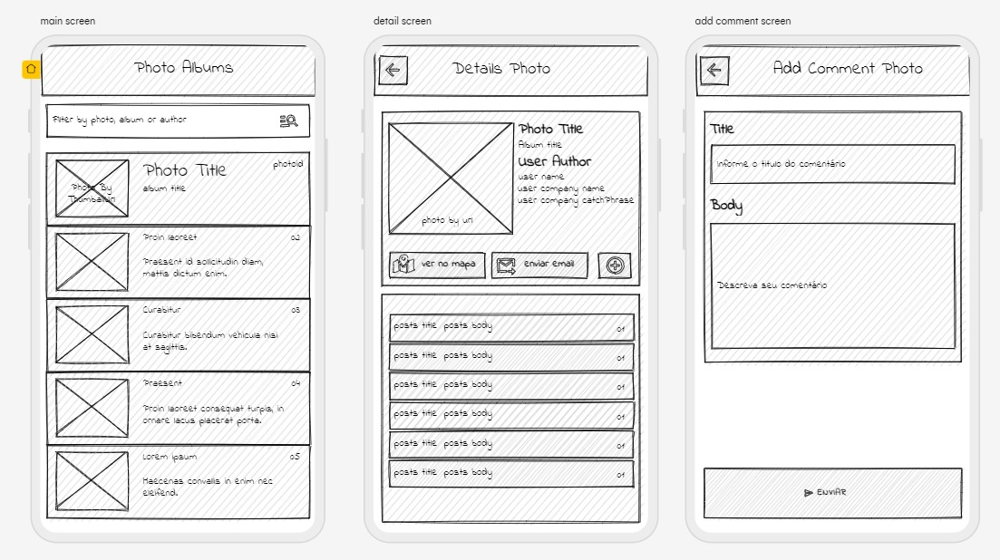

# PhotoAlbums# photo_album

Projeto de testes em flutter com integração com API e deeplink para google gmail e google maps.
O projeto consiste em um app mobile que traz um album de fotos compartilhados na nuvem, sendo possivel ver e interagir com elas.

## Getting Started

Para começar a analisar este projeto é preciso ter conhecimento de 3 problemas principais relacionados a API escolhida.

1. Relacionamento entre as Classes:
Nesta api, foto e post se relacionam somente pelo usuário, não mantendo nenhum relacionamento direto entre si. Portanto, para fins didáticos foi levando em consideração a seguinte máxima: Uma foto é considerada um post, isto é, se os ids são iguais eles são considerados os mesmo objetos.

2. Imagens: O domínio em que estavam armazenadas as imagens da API caiu, portanto nenhuma delas carregará.

3. Limite de Dados: A API tem um número limitado de dados. 5000 imagens, 100 posts, 10 usuários, 500 comentários e 100 albúmns. Portanto, a lista de fotos so é carregada até a 100º e os usuários estão presentes somente ate a 10º foto.

## Estrutura do projeto
Para este projeto utilizou-se as sequintes tecnologias.
- Signals: Para gerenciamento de estado reativo.
- Provider: Para injeção de dependências.
- Dio e Native_Dio_Adapter: Cliente HTTP para requisições.
- Url Launcher: Para DeepLink
- Logger
- String Similarity

As Estrutura do projeto consiste em separar as responsabilidades em camadas. 
- Data: Lida com requisições e conversões de json.
- Domain: Contém as entidades e regras de negócio da aplicação.
- Presentation: Respnsável pela UI/UX.
